# An Introduction to the NCBI and BLAST

This module is a short introduction to the [National Center for Biotechnology Information](https://www.ncbi.nlm.nih.gov) - or "NCBI" for short - and an overview of the various tools available there to the public. Of these tools, we will focus mostly on BLAST - the Basic Local Alignment Search Tool. 

An outline for the module is below:

  * [What is the NCBI?](#what-is-the-ncbi)
  * [What is BLAST?](#what-is-blast)
  * [How does BLAST work?](#how-does-blast-work)
  * [For what purposes would you use BLAST?](#for-what-purposes-would-you-use-blast)
  * [Let's BLAST something!](#lets-blast-something)
    * [Example One: Find a transgene in the papaya genome](#find-a-transgene-in-the-papaya-genome)
    * [Example Two: Finding novel sequences](#finding-novel-sequences) 
  * [Designing and validating primers with BLAST](#designing-and-validating-primers-with-blast)

***

##What is the NCBI? 

The [National Center for Biotechnology Information](https://www.ncbi.nlm.nih.gov) is an important component of the [National Library of Medicine](https://www.nlm.nih.gov) that has two broadly defined functions. First, the NCBI is tasked with hosting and maintaining a series of databases relevant to biotechnology and biomedicine. Secondly, the NCBI also serves to both curate and develop a wide variety of bioinformatics tools and services for researchers to use. We will take a better look at these two functions below. For further reading, a good overview of the history of the NCBI can be found [here](https://www.ncbi.nlm.nih.gov/books/NBK148949/). 

***

#### NCBI databases

 >Understanding nature's mute but elegant language of living cells is the quest of modern molecular biology. From an alphabet of only four letters representing the chemical subunits of DNA emerges a syntax of life processes whose most complex expression is man. The unraveling and use of this "alphabet" to form new "words and phrases" is a central focus of the field of molecular biology. The staggering volume of molecular data and its cryptic and subtle patterns have led to an absolute requirement for computerized databases and analysis tools. - *NCBI mission statement*


<p align="center">
<kbd>
  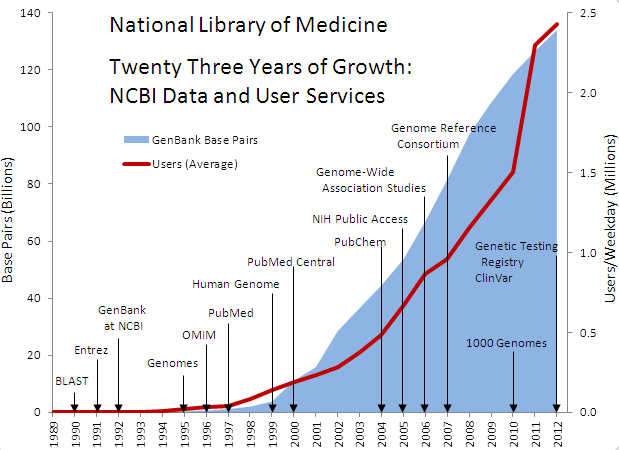
 </kbd>
 </p>
 <p align="center"
  <em>The Explosion of Sequencing Data - <i>National Library of Medicine</i></em>
</p>

***

With the rapid expansion of the availability of biological data in the Twentieth Century came the need for tools and software to both structure and query this data. This need brought together computer scientists, biologists, and government officials to help design and launch a variety of databases and protocols to assist researchers in both curating new knowledge and validating the old. For further reading, an interesting overview of the general history of bioinformatics (as related to computational structures) can be found [here](http://web.bf.uni-lj.si/bi/biokemija/bioinfo/2007/Material/Uvod1.pdf). 

Though there are many different databases available for users, Some of the more well-known databases at the NCBI include:

  * [PubMed](https://www.ncbi.nlm.nih.gov/pubmed): A search engine for accessing a variety of research publications (and their associated data) on life sciences and biomedical topics.
  * [Gene](https://www.ncbi.nlm.nih.gov/gene): A compilation of genes in a large number of organisms (animals, plants, fungi, bacteria, etc.) with information, annotation, and links to further resources to learn about each gene.
  * [GenBank](https://www.ncbi.nlm.nih.gov/genbank/): An annotated collection of all publicly available nucleotide sequences and their protein translations. 
  * [Sequence Read Archive](https://trace.ncbi.nlm.nih.gov/Traces/sra/sra.cgi?): Also known as the "Short Read Archive", the SRA is a bioinformatics database that provides a repository for sequencing data generated by next-generation, high-throuput sequencing - such as data generated for [RNA-Seq](https://www.ncbi.nlm.nih.gov/pmc/articles/PMC2949280/) or [ChIP-seq](http://bitesizebio.com/13541/an-introduction-to-chip-seq/) experiments. 

A full list of the available resources and tools may be found [here](https://www.ncbi.nlm.nih.gov/guide/all/).

These different databases are all linked together by the [Entrez](https://en.wikipedia.org/wiki/Entrez) search engine. Entrez (French for "Come in") allows users to search many of the different databases hosted by NCBI all at the same time, thus allowing for simple queries to produce very wide-ranging results. As an example: if we search the string **CFTR** (a gene responsible for encoding a protein important to the pathology of cystic fibrosis in *Homo sapiens*):

<p align="center">
<kbd>
  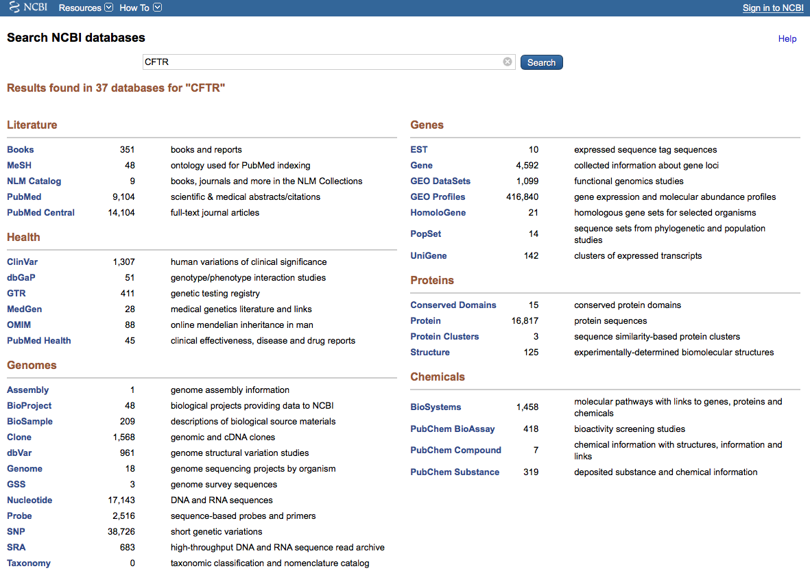
</kbd>
</p>

As shown above: the query returned a rich selection of results that could be used to answer a variety of different scientific questions. If we were interested in DNA or RNA sequences, we would find them in the **Nucleotide* database. If we were looking for human variations of the gene, we'd be able to find this in the **SNP** (Single Nucleotide Polymorphisms) database, and so on. This kind of information retrieval is only possible because of the unified structures that exist between the databases and the Entrez search engine. 

***

## CHALLENGE

Search for the gene symbol **POMC**, look up information about the gene in *Homo sapiens*, and report three known phenotypic variations associated with this particular gene. 

***

First, navigate to [Entrez](https://www.ncbi.nlm.nih.gov/gquery/) and search for the gene symbol **POMC**. Then click "Search". When your results are returned, click "Gene".

<p align="center">
<kbd>
  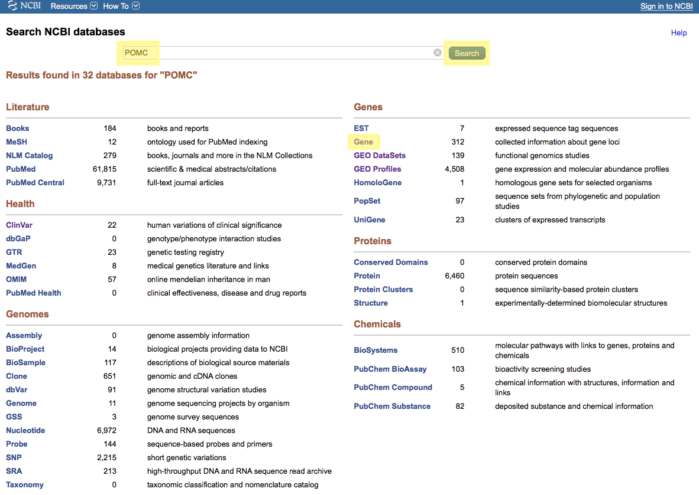
</kbd>
</p>

**NOTE**: If you'd like to search specifically for a gene symbol you can use the search term **POMC[sym]**.


Next, look for the entry in the query results that is for the gene found in *Homo sapiens*. When you find it, click the gene symbol.

<p align="center">
<kbd>
  
</kbd>
</p>


This page returns a large list of genes where *POMC* is the gene symbol, much in the same way a Google search returns a list of websites with a matching keyword. Note that each of these gene symbols is linked to a different organism. 

<p align="center">
<kbd>
  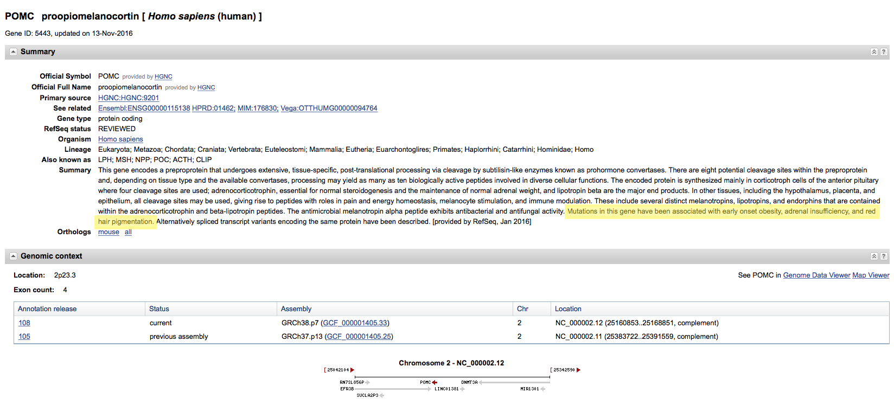
</kbd>
</p>


Importantly, many genes have thorough summaries that can provide the user with a quick overview of the scientific knowledge of the gene in question. Upon inspecting the information available in the summary for **POMC**, we can see that mutations in this gene have been identified with the following phenotypic variations in human beings:
  
  * Early onset obesity
  * Adrenal insufficiency
  * Red hair

Fascinating! There's a wide variety of information to be found amongst the various databases that the NCBI has to offer. Take a few moments to explore the information available about the **POMC** gene before moving on. 

From James Watson, Nobel laureate and co-discoverer of the structure of DNA:

>One gene fascinates me: POMC, on chromosome 2, which is a recipe for a protein called ­pro-opiomelanocortin. In the body it gets broken up into different proteins, including melanotropin, which makes the skin darker when you’ve been in the sun, and beta-endorphin, a natural opioid that makes you feel satisfied after eating and also causes the ‘runner’s high.’ It’s the only gene I know whose very structure is an implicit biological message: Happiness is a reward for doing what we should be doing—for being in the sun and making vitamin D, for exercising and for bringing nutrients into our bodies. Eons ago these messages were delivered by the genes of our vertebrate ancestors on this planet. Now they are passed down to us. 


***

#### NCBI tools

The tools available on the NCBI website provide users with a wide variety of ways to manipulate, investigate, and visualize biological data. An exhaustive list of these tools is available [here](https://www.ncbi.nlm.nih.gov/home/analyze.shtml). Some of the more popular tools provided by the NCBI include: 

  * The Open Reading Frame Finder (ORF Finder)
    * This tool is used to find potential polypeptide products for a given coding sequence. 
  * Batch Entrez 
    * This tool allows you to retrieve a set of results from different databases using a list of accession numbers. 

However, the most popular tool by far is BLAST (and its many variations). What BLAST is, how it works, and what it's used for are the topics of the next section.

***

##What is BLAST?

<p align="center">
<kbd>
  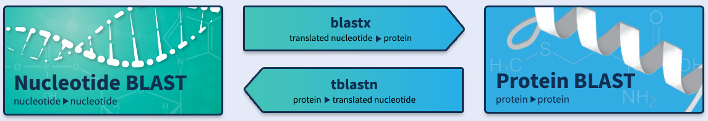
</kbd>
</p>


***

BLAST, or the Basic Local Alignment Search Tool, is an algorithmic tool for comparing biological sequence information, such as protein, amino-acid, or nucleotide sequences. A BLAST search allows a researcher to compare a query sequence with a library or database of other sequences, returning matches between the two that meet certain criteria (such as being above a certain statistical threshold). There are a variety of different mways BLAST can be used for different sequence comparisons, but the five basic tools that are available as web applications on the NCBI website are:

  * `blastn`: comparing nucleotide sequences to nucleotide sequences with alignments at the nucleotide level
  * `blastp`: comparing protein sequences to protein sequences with the alignments at the protein level
  * `blastx`: comparing translated nucleotide sequences to protein sequences with alignments at the protein level
  * `tblastn`: comparing translated protein sequences to nucleotide sequences with alignments at the nucleotide level
  * `tblastx`: comparing translated nucleotide sequences to translated nucleotide sequences, with alignments at the protein level

***

##How does BLAST work?

<p align="center">
<kbd>
  
</kbd>
</p>
<p align="center"
  <em>The painful reality of some bioinformatics tools.- <i>XKCD</i></em>
</p>

***

As with many algorithmic tools, the technical details of how BLAST works can be difficult to understand. We will avoid the more technical parts of how BLAST operates and instead offer a more holistic approach to understand its functions. If you'd like to read further, the original paper from Altschul et. al can be found [here](https://www.researchgate.net/profile/Stephen_Altschul/publication/20923774_Basic_Local_Alignment_Search_Tool/links/0fcfd50eada1ddc587000000.pdf). A very thorough discussion of the statistical theory behind BLAST is available [here](http://www.math.uzh.ch/?file&key1=14036). 

At a very high-level, a BLAST search involves the following steps:

  1. Parse the library sequences and query sequences into 3 letter "words".
  2. Identify library sequences that match the query sequences above a certain threshold score.
  3. Extend the sequence comparison between the library and query sequences in both directions.
  4. Report a hit in the search results if the comparisons meet or exceed a cut-off for statistical significance. 

Let's break down each of these steps. 

***

####Step 1: Parse the sequences into "words"

Let's use an example protein sequence like one would expect to see in a proteomics experiment: 

`NLYENFVQATFN`

(For those interested - this particular sequence of amino acids is from the amino terminal of the protein phosphoglucomutase in *Aradbidopsis thaliana*, a popular model organism in plant biology). 

The first step in BLAST is to break this protein sequence down into 3 letter "words", or shortened sequences. 

`NLY LYE YEN ENF NFV FVQ VQA QAT ATF TFN`

By breaking the sequence down into smaller segments, the computational requirements for searching between the query sequences and the databsae sequences. 

***

####Step 2: Identify high-scoring matches between query sequences and library sequences

In order to "score" a match, a substitution matrix needs to be created so that we can compare values along a sequence to one another and measure their similarity. BLAST uses a Block Substitution Matrix (known as [BLOSUM](https://en.wikipedia.org/wiki/BLOSUM)). Each different iteration of BLAST uses a different substitution matrix: for protein-to-protein comparisons, the matrix is known as BLOSUM62. It looks like this:

<p align="center">
<kbd>
  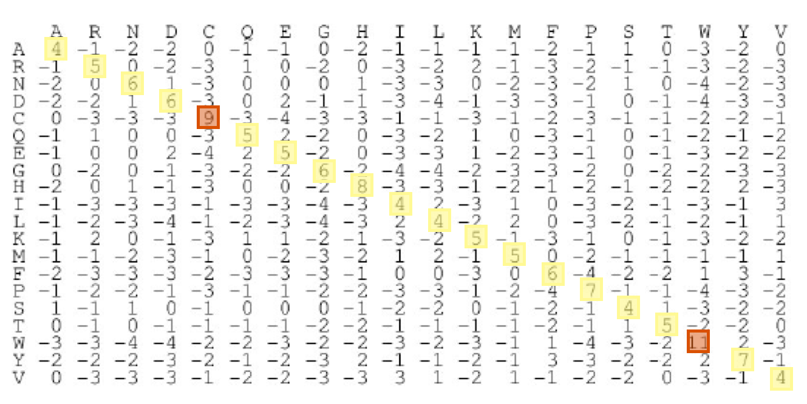
</kbd>
</p>
<p align="center"
  <em>Don't let this scare you! I promise, you won't be doing too much math.</em>
</p>

Returning to our example: Let's imagine that we're comparing our plant protein above to an ortholog in rabbit muscle tissue. 

```
Query        NLY  
Subject   SSTNYAENTIQSIISTVEPAQR
```

We know that when an `N` matches another `N`, this is scored as a 6. The `L`/`Y` mismatch is a -1. The `Y`/`A` mismatch is a -2. Thus the "score" for this word is a 3. In the original instance of BLAST, only words whose matching scores were above 18 were used as "seeds" to extend the alignment. As it turns out, no single word in our query sequence has a sufficiently high enough score to proceed. However, when multiple words are used to build the string, this may not be true! For example:

```
Query           ENFVQA 
Subject   SSTNYAENTIQSIISTVEPAQR
```

Here, we get `5+6-2+3+5+1=18`. A-ha! 

***

####Step 3: Extend the sequence comparison between the library and query sequences in both directions.

Next, the BLAST algorithm will begin to extend the "seed" word by one unit in each direction. If the overall score of this new alignment falls below a certain threshold, the algorithm will cease. 

```
Query          YENFVQAT
Subject   SSTNYAENTIQSIIS[TVEPAQR]
```
The new score for the above is `-2+5+6-2+3+5+1-1=15`. Hm. This is slightly worse. However, it has not dropped below the algorithm's stopping threshold (which is based on a very complicated formula that we won't show here.)

Continuing to the end:

```
Query       NLYENFVQATFN
            NY ENF+Q+  +
Subject     NYAENTIQSIIS
```

The centerline provides the following information. A letter designates an identity (or high similarity) between the two sequences. A “+” means the two sequences are similar but not highly similar. If no symbol is given between the two sequences, then a non-similar substitution has occurred. The score for the above (ignoring the bracketed sections of the library sequence) would be `5-1-2+5+6-2+3+5+1-1+0+1=20`. Pretty good!

***

####Step 3: Report a hit if significant

If the queried sequence matches the library sequence and is deemed to be statistically significant after correction for multiple testing, then that is considered a positive "hit" and is reported. Your report might look something like this:

<p align="center">
<kbd>
  
</kbd>
</p>

***

...confused by the sentence above regarding statistical significance and multiple testing? That's okay - statistics can be confusing. However, BLAST (and many algorithms like it) are inherently *statistical* by nature: they are making heuristic judgments based on probabilities that matches are true and not false positives. Gaining a deeper knowledge of statistics is crucial to a career in bioinformatics - or biology in general. Some good resources for learning are [here](http://chagall.med.cornell.edu/BioinfoCourse/PDFs/Lecture3/bioinformatics_tutorial.pdf) and [here](https://cran.r-project.org/doc/contrib/Seefeld_StatsRBio.pdf).

***

##CHALLENGE

Using BLOSUM62, find the similarity score of the following sequences:

```
Query       MLFTVSCSKM SSIVDRDDSS
Subject     MFFTISTHKM SSIADRNDGS
```

***

`5 + 0 + 6 + 5 + 3 + 4 - 1 - 1 + 5 + 5 + 4 + 4 + 4 + 0 + 6 + 5 + 1 + 6 + 0 + 4 = 113`! 

 With an alignment profile that looks like this:

```
Query       MLFTVSCSKMSSIVDRDDSS  
            M FT+S  KMSSI DR+D S
Subject     MFFTISTHKMSSIADRNDGS  
```

This is the first twenty amino acids of the [CLOCK](http://www.uniprot.org/uniprot/O15516) protein. This protein plays a vital role in regulating various physiological processes associated with the circadian rhythm. The query sequence is from *Homo sapiens*, the library sequence is from *Gallus gallus*, the domesticated chicken. Turns out this is a pretty highly conserved protein between species! 

***

##For what purposes would you use BLAST? 

The following are some example situations where one could use a BLAST search: 

  * Following the discovery of a previously unknown gene in the mouse, a researcher might perform a BLAST search of the human genome to see if humans carry a similar gene.
  * A researcher may have been given a bit of DNA from an unknown species. By running a BLAST query, the researcher may be able to correctly identify the species (or find a homologous one). (**Note**: this is basically the plot of the first 50 pages of [Jurassic Park](https://en.wikipedia.org/wiki/Jurassic_Park_(novel)))
 
 We will offer two motivating examples of a BLAST search below. The first example will be on identifying a transgene with BLAST in a genetically modified organism. The second example will show how one can find novel and unexpected genomic information using BLAST.

 ***

##Let's BLAST something! 

Below, we are going to work through two different research examples requiring the use of BLAST. 

***

###Find a transgene in the papaya genome

<p align="center">
<kbd>
  
</kbd>
</p>
<p align="center"
  <em><i>Carica papaya</i></em>
</p>

The papaya is a tropical fruit native to Central and South America. In terms of global production, it is fourth in terms of tonnage (after bananas, oranges, and mango) and is an incredibly important agricultural export for many nations and municipalities, including the state of Hawaii. It is also, coincidentally, delicious.

...that is, unless it suffers infection by the [Papaya ringspot virus](https://en.wikipedia.org/wiki/Papaya_ringspot_virus) (PRSV), a *Potyvirus* that causes both severe growth retardation and a rapid decline in overall fruit quality in the plant. When this virus began to destroy entire harvests of papaya in Hawaii, several different research institutions (including the University of Hawaii and Cornell University) came together to create two genetically modified variants of papaya called *Rainbow* and *SunUp*. These transgenic varieties express the coat protein (CP) gene from PRSV to provide resistance to infection. These genetically modified variants are wildly successful and represent nearly three-quarters of all papaya grown in Hawaii. (For more history, click [here](https://www.apsnet.org/edcenter/intropp/lessons/viruses/Pages/PapayaRingspotvirus.aspx), and for a more technical read on how this transgenic variety was created, click [here](https://www.researchgate.net/profile/Blake_Meyers/publication/6626845_Use_of_massively_parallel_signature_sequencing_to_study_genes_expressed_during_the_plant_defense_response/links/0a85e52fa6788198e2000000.pdf#page=210)).

The goal of this example is to locate the raw sequence of the CP gene from the NCBI, and use a BLAST search to find this sequence in the papaya genome. 

***

Navigate to the NCBI website and search for the Papaya ringspot virus coat protein in all databases. 

<p align="center">
<kbd>g
  
</kbd>
</p>

From the results list, navigate to the **Gene** database.

<p align="center">
<kbd>g
  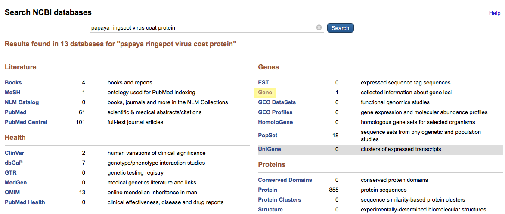
</kbd>
</p>

You are now looking at a lot of information related to the PRSVgp1 gene in the Papaya ringspot virus. Much of this information requires a deeper look at the genetics of viruses (a quick overview is [here](http://www.course-notes.org/Biology/Outlines/Chapter_18_The_Genetics_of_Viruses_and_Bacteria)), but what we need is found beneath the subsection *NCBI Reference Sequences*. In this subsection, you'll see an area titled **mRNA and Protein(s)**. In the list of proteins, you'll see *NP_73424.1 coat protein*, the potyvirus coat protein. Click it.  

<p align="center">
<kbd>g
  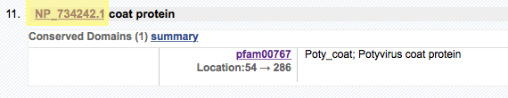
</kbd>
</p>

This will bring you to the NCBI reference sequence page. 

<p align="center">
<kbd>g
  
</kbd>
</p>

On the right hand side of the screen, beneath the section *Analyze this sequence*, you'll see an option to *Run BLAST*. Click this link. 

<p align="center">
<kbd>g
  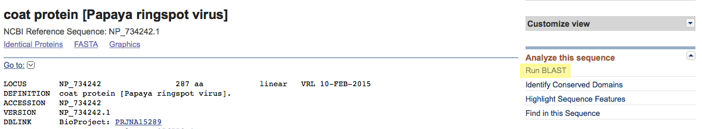
</kbd>
</p>

You'll now see that you are in the `blastn` suite. We need to change this, as we want to align a protein sequence to the nucleotide sequence of the Papaya. Do you remember which type of BLAST search we would use? 

From the top toolbar, click `tblastn`. 

<p align="center">
<kbd>g
  
</kbd>
</p>

You'll see that the NCBI already imported the accession number from the PRSV coat protein into your query sequence area. Below, next to the section marked *Orgnanism*, type in *Carica papaya* and select the appropriate organism (the taxid should equal 3649). When this is completed, click the BLAST button at the bottom of the page.

<p align="center">
<kbd>g
  
</kbd>
</p>

Behind the scenes, the NCBI is now performing a BLAST search between the coat protein sequence and a translated nucleotide sequence of the Papaya genome. This may take some time to complete, depending on the availability of resources at the NCBI. Your screen will continually refresh while this is taking place. 

When it's completed, you'll see your BLAST results. 

<p align="center">
<kbd>g
  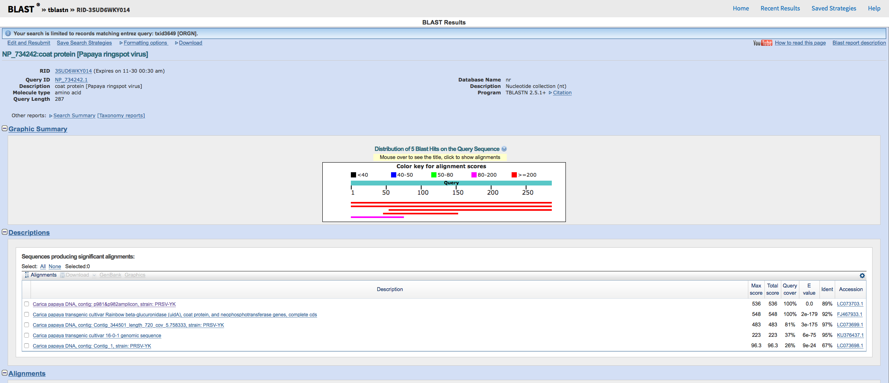
</kbd>
</p>

Take your time to examine the results page. An area of particular importance is the *Alignments* section. Note that the search has produced multiple alignments, each to different biological samples of *Carica papaya*. Also note how high the matching scores (for "positives") are: 98-99%. We have thus used a BLAST search to find the transgenic protein that has been inserted into the genome of specific strains of papaya. You could now use the same approximate method to search for known transgenic genes in other genetically modified organisms. 

***

###Finding novel sequences

<p align="center">
<kbd>
  
</kbd>
</p>
<p align="center"
  <em>An insect cell with a <i>Wolbachia</i> infection</em>
</p>

***

There are a multitude of technologies for sequencing DNA, with the list growing continuously (and [exponentially](http://www.economist.com/node/7854314)). One of the more commonly used methods for producing draft sequences of entire genomes is known as [shotgun sequencing](https://en.wikipedia.org/wiki/Shotgun_sequencing). Shotgun sequencing works (more or less) like this:

<p align="center">
<kbd>
  
</kbd>
</p>

First, the DNA molecule is fragmented into random pieces (hence the "shotgun"). Then, these pieces are computationally aligned to produce an assembly of overlapping DNA sequences that, when completed, produce an assembled sequence for that particular strand of DNA. This technology allows for the possibility of sequencing a whole genome at once with a large array of sequencers and the methodology underpins much of what we think of as Next-generation sequencing. 

However, rather than focusing on the technical details, let's instead focus on the biology. The physical material required for sequencing can come from many different types of tissue within the query organism. What may happen if the organism in question contains an intracellular endosymbiont? 

*Salzburg et al*. aimed to answer that question in [a paper](https://genomebiology.biomedcentral.com/articles/10.1186/gb-2005-6-3-r23) that focused on searching the sequenced *Drosophila* (fruit fly) genome for traces of a known parasite, *Wolbachia* (shown above). The ability to search genomic data in this way is only possible due to the depositing of raw data into a central genomic repository and the practice of making it available: one of the main operational objectives of the NCBI. Below, we will walk through the same steps as taken in the paper to show how much *Wolbachia* genetic material can be discovered in the raw data of a *Drosophila* sequencing project.

***

First, navigate to the NCBI website and search for Wolbachia. Click **Assembly**.

<p align="center">
<kbd>
  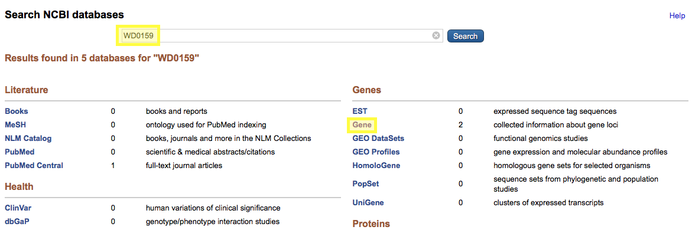
</kbd>
</p>

A list of different *Wolbachia* genome assemblies will be returned. Click the first assembly: `ASM802v1`. 

<p align="center">
<kbd>
  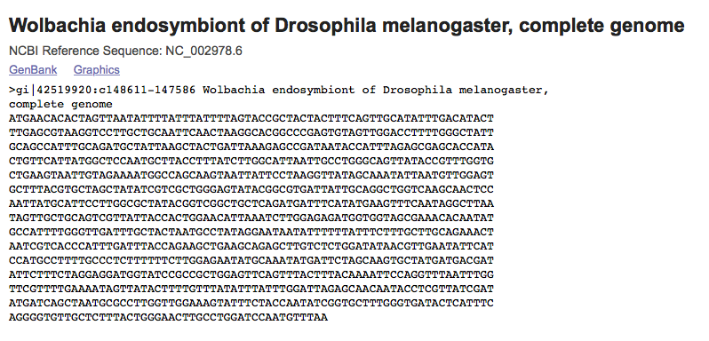
</kbd>
</p>

You'll now be viewing the assembly report. Towards the bottom of the screen, take note of the RefSeq sequence ID: NC_002978.6

Navigate to the Trace Archives by clicking [here](https://trace.ncbi.nlm.nih.gov/Traces/assembly/) or going to trace.ncbi.nlm.nih.gov/Traces/assembly. The trace archives is a repository of fully and partially complete genomic asssemblies that were created from gel/capillary platforms, such as older Applied Biosystems techniques. 

When you are there, click **Trace Blast**

<p align="center">
<kbd>
  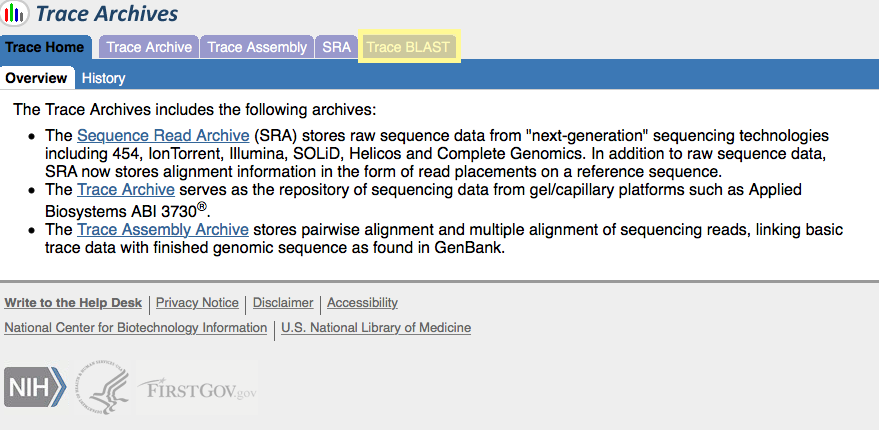
</kbd>
</p>

In the **Enter Query Sequence** section, input the RefSeq sequence ID from above: NC_002978.6. In the **Choose Search Set** area, choose Drosophila melanogaster - WGS. Then click BLAST.

<p align="center">
<kbd>
  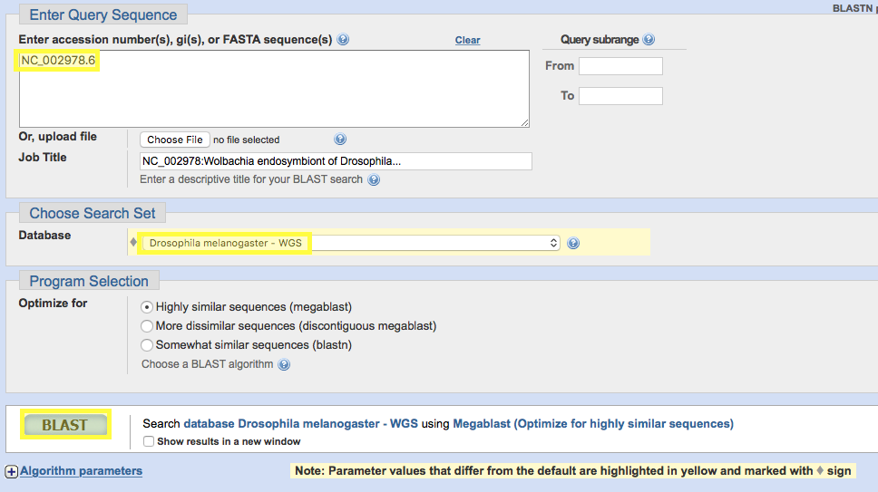
</kbd>
</p>

When this completes, your results should look something like this:

<p align="center">
<kbd>
  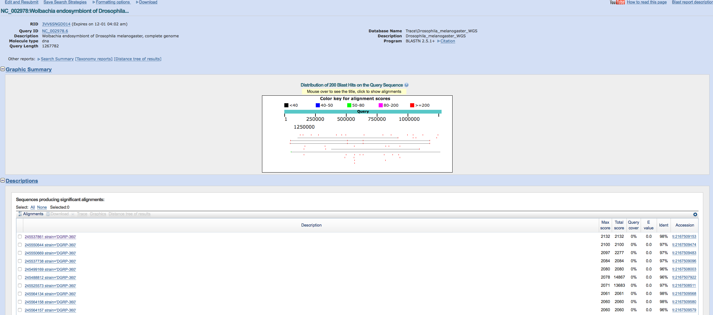
</kbd>
</p>

Take a few moments to examine this page, including the **Alignments** section. You'll notice that there are literally *hundreds* of sequence hits between the *Wolbachia* sequence and the *Drosophila* genome. What's happening? 

Effectively, what you've just done is gone "dumpster diving" in the *Drosophila* genome. When many of these biological samples were created via shotgun sequencing, a lot of genetic material from *Wolbachia* were included in the libraries that were sequenced due to latent infections. This material can then be recovered in the raw data, yet usually (hopefully) doesn't end up being falsely included in the actual genome assembly. By searching the Trace archive, we were able to see just how common it is for this to occur. In fact, it's possible to recover an entire *Wolbachia* genome just from sequencing data for *Drosophila*!

***

##Designing and validating primers with BLAST

<p align="center">
<kbd>
  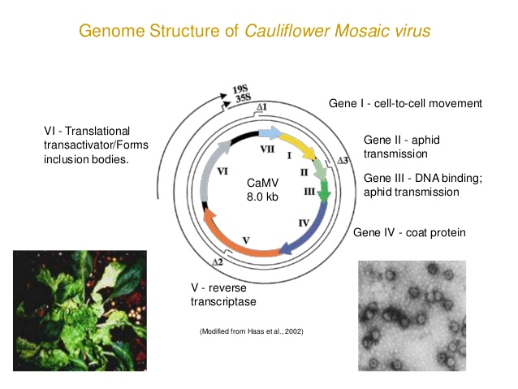
</kbd>
</p>

As we've already learned, a [promoter](https://en.wikipedia.org/wiki/Promoter_(genetics)) is a region of DNA that initiatives the transcription of a gene. The majority of genetically modified plants have been transformed with constructs containing the [Cauliflower Mosaic Virus](https://en.wikipedia.org/wiki/Cauliflower_mosaic_virus) (CaMV) 35s promoter (P-35S) due to its unique characteristics as a strong constitutive promoter. We hypothesize then that we should be able to design a primer *in silico* using `PRIMER3` and align such a primer against a target genome to find potential [amplicons](https://en.wikipedia.org/wiki/Amplicon) for that primer. 

***

First, we must obtain the sequence containing the CaMV35S promoter. Click [here](https://www.ncbi.nlm.nih.gov/nuccore/894139?report=fasta&to=896) to go directly to the sequence in question to obtain the sequence yourself, or reference the sequence below:

```
>gb|U28417.1|XXP35SGFP:1-896 Cloning vector p35S-GFP, complete sequence
AAGCTTGCATGCCTGCAGGTCCCCAGATTAGCCTTTTCAATTTCAGAAAGAATGCTAACCCACAGATGGT
TAGAGAGGCTTACGCAGCAGGTCTCATCAAGACGATCTACCCGAGCAATAATCTCCAGGAAATCAAATAC
CTTCCCAAGAAGGTTAAAGATGCAGTCAAAAGATTCAGGACTAACTGCATCAAGAACACAGAGAAAGATA
TATTTCTCAAGATCAGAAGTACTATTCCAGTATGGACGATTCAAGGCTTGCTTCACAAACCAAGGCAAGT
AATAGAGATTGGAGTCTCTAAAAAGGTAGTTCCCACTGAATCAAAGGCCATGGAGTCAAAGATTCAAATA
GAGGACCTAACAGAACTCGCCGTAAAGACTGGCGAACAGTTCATACAGAGTCTCTTACGACTCAATGACA
AGAAGAAAATCTTCGTCAACATGGTGGAGCACGACACACTTGTCTACTCCAAAAATATCAAAGATACAGT
CTCAGAAGACCAAAGGGCAATTGAGACTTTTCAACAAAGGGTAATATCCGGAAACCTCCTCGGATTCCAT
TGCCCAGCTATCTGTCACTTTATTGTGAAGATAGTGGAAAAGGAAGGTGGCTCCTACAAATGCCATCATT
GCGATAAAGGAAAGGCCATCGTTGAAGATGCCTCTGCCGACAGTGGTCCCAAAGATGGACCCCCACCCAC
GAGGAGCATCGTGGAAAAAGAAGACGTTCCAACCACGTCTTCAAAGCAAGTGGATTGATGTGATATCTCC
ACTGACGTAAGGGATGACGCACAATCCCACTATCCTTCGCAAGACCCTTCCTCTATATAAGGAAGTTCAT
TTCATTTGGAGAGAACACGGGGGACTCTAGAGGATCCATAGATCTGATAACAAAGA
````
Next, go to the [Primer3](http://biotools.umassmed.edu/bioapps/primer3_www.cgi) website - biotools.umassmed.edu/bioapps/primer3_www.cgi. This is a free, web-based tool that will design primer sequences from a reference DNA sequence. Copy and paste the sequence above into the input box and click "pick primers".

<p align="center">
<kbd>
  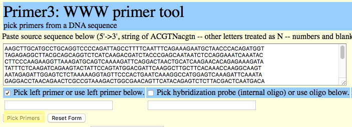
</kbd>
</p>

This will return a list of primers. Choose the primers from the top and copy and paste them. **Note**: there are occasions where the first primer returned may not be the most desirable. In this situation, feel free to use any of the additional oligos returned at the bottom of the page. 

<p align="center">
<kbd>
  
</kbd>
</p>

Next, return to [BLAST](https://blast.ncbi.nlm.nih.gov/Blast.cgi?PROGRAM=blastn&PAGE_TYPE=BlastSearch&LINK_LOC=blasthome) and run a a nucleotide-to-nucleotide search using `blastn`. Paste your primer into the query sequence area. Next, change the database to search against to whole genome shotgun contigs. After that, under Program Selection, make sure set the option to "somewhat similar sequences". Finally, set your organism to *Carica papaya*. BLAST away! 

**Note**: I have extracted just the nucleotide sequence from the primer results above and concatenated.  

<p align="center">
<kbd>
  
</kbd>
</p>

Voila! You have found your sequence. 

<p align="center">
<kbd>
  
</kbd>
</p>

As you can see, this is a different strain of genetically modified Papaya - a strain called *SunUp*. 
