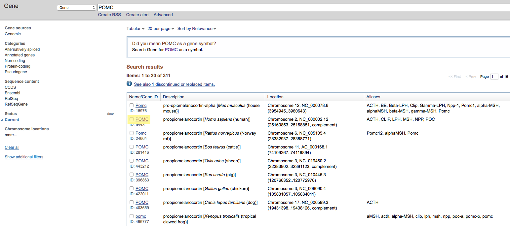
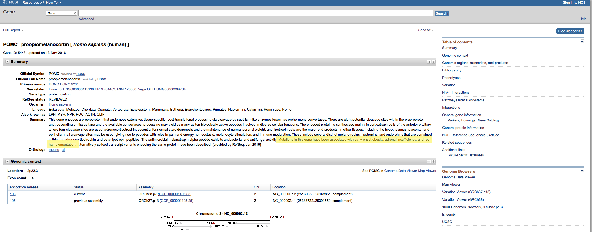
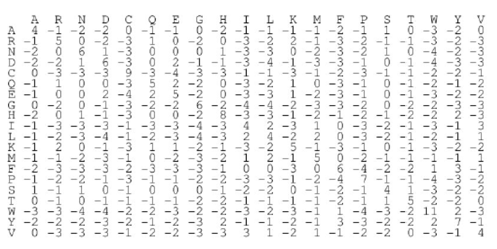
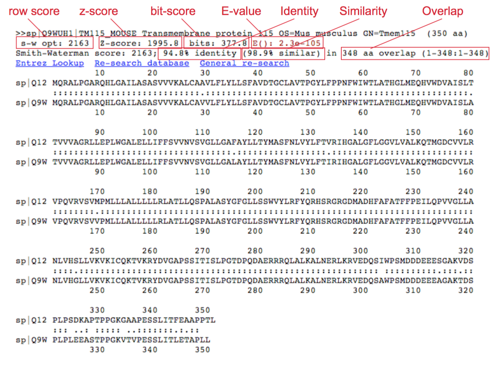

# An Introduction to the NCBI and BLAST

This module is a short introduction to the [National Center for Biotechnology Information](https://www.ncbi.nlm.nih.gov) - or "NCBI" for short - and an overview of the various tools available there to the public. Of these tools, we will focus mostly on BLAST - the Basic Local Alignment Search Toool. 

An outline for the module is below:

  * [What is the NCBI?](#what-is-the-ncbi)
  * [What is BLAST?](#what-is-blast)
  * [How does BLAST work?](#how-does-blast-work)
  * [For what purposes would you use BLAST?](#for-what-purposes-would-you-use-blast)
  * Let's BLAST something!
    * Example One: Find a transgene in the Papaya Genome.
    * Example Two: Finding novel sequences 
  * Designing and Validating Primers with BLAST

***

##What is the NCBI? 

The [National Center for Biotechnology Information](https://www.ncbi.nlm.nih.gov) is an important component of the [National Library of Medicine](https://www.nlm.nih.gov) that has two broadly defined functions. First, the NCBI is tasked with hosting and maintaining a series of databases relevant to biotechnology and biomedicine. Secondly, the NCBI also serves to both curate and develop a wide variety of bioinformatics tools and services for researchers to use. We will take a better look at these two functions below. For further reading, a good overview of the history of the NCBI can be found [here](https://www.ncbi.nlm.nih.gov/books/NBK148949/). 

***

#### NCBI databases

 >Understanding nature's mute but elegant language of living cells is the quest of modern molecular biology. From an alphabet of only four letters representing the chemical subunits of DNA emerges a syntax of life processes whose most complex expression is man. The unraveling and use of this "alphabet" to form new "words and phrases" is a central focus of the field of molecular biology. The staggering volume of molecular data and its cryptic and subtle patterns have led to an absolute requirement for computerized databases and analysis tools. - *from the NCBI mission statement*


<p align="center">
<kbd>
  
 </kbd>
 </p>
 <p align="center"
  <em>The Explosion of Sequencing Data - <i>National Library of Medicine</i></em>
</p>

***

With the rapid expansion of the availability of biological data in the Twentieth Century came the need for tools and software to both structure and query this data. This need brought together computer scientists, biologists, and government officials to help design and launch a variety of databases and protocols to assist researchers in both curating new knowledge and validating the old. For further reading, an interesting overview of the general history of bioinformatics (as related to computational structures) can be found [here](http://web.bf.uni-lj.si/bi/biokemija/bioinfo/2007/Material/Uvod1.pdf). 

Though there are many different databases avialable for users, Some of the more well-known databases at the NCBI include:

  * [GenBank](https://www.ncbi.nlm.nih.gov/genbank/): An annotated collection of all publically available nucloetide sequences and their protein translations. 
  * [PubMed](https://www.ncbi.nlm.nih.gov/pubmed): A search engine for accessing a variety of research publications (and their associated data) on life sciences and biomedical topics.
  * [Sequence Read Archive](https://trace.ncbi.nlm.nih.gov/Traces/sra/sra.cgi?): Also known as the "Short Read Acrhive", the SRA is a bioinformatics database that provides a repository for sequencing data generated by next-generation, high-throuput sequencing - such as data generated for [RNA-Seq](https://www.ncbi.nlm.nih.gov/pmc/articles/PMC2949280/) or [ChIP-seq](http://bitesizebio.com/13541/an-introduction-to-chip-seq/) experiments. 

A full list of the available resources and tools may be found [here](https://www.ncbi.nlm.nih.gov/guide/all/).

These different databases are all linked together by the [Entrez](https://en.wikipedia.org/wiki/Entrez) search engine. Entrez (French for "Come in") allows users to search many of the different databases hosted by NCBI all at the same time, thus allowing for simple queries to produce very wide-ranging results. As an example: if we search the string **CFTR** (a gene responsible for encoding a protein important to the pathology of cystic fibrosis in *Homo sapiens*):

<p align="center">
<kbd>
  
</kbd>
</p>

As shown above: the query returend a rich selection of results that could be used to answer a variety of different scientific questions. If we were interested in DNA or RNA sequences, we would find them in the **Genome** database. If we were looking for human variations of the gene, we'd be able to find this in the **ClinVar** database, and so on. This kind of information retrieval is only possible because of the unified structures that exist between the databases and the Entrez search engine. 

***

## CHALLENGE

Search for the gene symbol **POMC**, look up information about the gene in *Homo sapiens*, and report three known phenotypic variations associated with this particular gene. 

***

First, navigate to [Entrez](https://www.ncbi.nlm.nih.gov/gquery/) and search for the gene symbol **POMC**. Then click "Search". When your results are returned, click "Gene".

<p align="center">
<kbd>
  
</kbd>
</p>

**NOTE**: If you'd like to search specifically for a gene symbol you can use the search term **POMC[sym]**.


Next, look for the entry in the query results that is for the gene found in *Homo sapiens*. When you find it, click the gene symbol.

<p align="center">
<kbd>
  
</kbd>
</p>


This page returns a large amount of information about the **POMC** gene. 

<p align="center">
<kbd>
  
</kbd>
</p>


Importantly, many genes have thorough summaries that can provide the user with a quick overview of the scientific knowledge of the gene in question. Upon inspecting the information available in the summary for **POMC**, we can see that mutations in this gene have been identified with the following phenotypic variations in human beings:
  
  * Early onset obesity
  * Adrenal insufficiency
  * Read hair

Fascinating! There's a wide vairety of information to be found amongst the various databases that the NCBI has to offer. Take a few moments to explore the information available about the **POMC** gebe before moving on. 

From James Watson, Nobel laureate and co-discoverer of the structure of DNA:

>One gene fascinates me: POMC, on chromosome 2, which is a recipe for a protein called ­pro-opiomelanocortin. In the body it gets broken up into different proteins, including melanotropin, which makes the skin darker when you’ve been in the sun, and beta-endorphin, a natural opioid that makes you feel satisfied after eating and also causes the ‘runner’s high.’ It’s the only gene I know whose very structure is an implicit biological message: Happiness is a reward for doing what we should be doing—for being in the sun and making vitamin D, for exercising and for bringing nutrients into our bodies. Eons ago these messages were delivered by the genes of our vertebrate ancestors on this planet. Now they are passed down to us. 


***

#### NCBI tools

The tools available on the NCBI website provide users with a wide variety of ways to manipulate, investigate, and visualize biological data. An exhaustive list of these tools is avialable [here](https://www.ncbi.nlm.nih.gov/home/analyze.shtml). Some of the more popular tools provided by the NCBI include: 

  * The Open Reading Frame Finder (ORF Finder)
  * Electronic PCR (e-PCR)
  * The Genome Workbench. 

However, the most popular tool by far is BLAST (and its many variations). What BLAST is, how it works, and what it's used for are the topics of the next section.

***

##What is BLAST?

<p align="center">
<kbd>
  
</kbd>
</p>


***

BLAST, or the Basic Local Alignment Search Tool, is an algorithmic tool for comparing biological sequence information, such as protein, amino-acid, or nucleotide sequences. A BLAST search allows a researcher to compare a query sequence with a library or database of other sequences, returning matches between the two that meet certain criteria (such as being above a certain statistical threshold). There are a variety of different iterations of BLAST (a different iteration for different sequence comparisons), but the four most popular (as shown above) that are available as web applications on the NCBI website are:

  * `blastn` (comparing nucleotides to nucleotides)
  * `blastx` (comparing translated nucleotides to proteins sequences)
  * `tblastn` (comparing translated protein sequences to nucleotides)
  * `blastp` (comparing protein sequences to other protein sequences).

***

##How does BLAST work?

<p align="center">
<kbd>
  
</kbd>
</p>
<p align="center"
  <em>The painful reality of some bioinformatics tools.- <i>XKCD</i></em>
</p>

***

As with many algorithmic tools, the technical details of how BLAST works can be difficult to understand. We will avoid the more technical parts of how BLAST operates and instead offer a more holistic approach to understand its functions. If you'd like to read further, the original paper from Altschul et. al can be found [here](https://www.researchgate.net/profile/Stephen_Altschul/publication/20923774_Basic_Local_Alignment_Search_Tool/links/0fcfd50eada1ddc587000000.pdf). A very thorough discussion of the statistical theory behind BLAST is available [here](http://www.math.uzh.ch/?file&key1=14036). 

At a very high-level, a BLAST search involves the following steps:

  1. Parse the library sequences and query sequences into 3 letter "words".
  2. Identify library sequences that match the query sequences above a certain threshold score.
  3. Extend the sequence comparison between the library and query sequences in both directions.
  4. Report a hit in the search results if the comparisons meet or exceed a cut-off for statistical significance. 

Let's break down each of these steps. 

***

####Step 1: Parse the sequences into "words"

Let's use an example protein sequence like one would expect to see in a proteomics experiment: 

`NLYENFVQATFN`

(For those so interested - this particular sequence of amino acids is from the amino terminal of the protein phosphoglucomutase in *Aradbidopsis thaliana*, a popular model organism in plant biology). 

The first step in BLAST is to break this protein sequence down into 3 letter "words", or shortened sequences. 

`NLY LYE YEN ENF NFV FVQ VQA QAT ATF TFN`

By breaking the sequence down into smaller segments, the computational requirements for searching between the query sequences and the databsae sequences. 

***

####Step 2: Identify high-scoring matches between query sequences and library sequences

In order to "score" a match, a substiution matrix needs to be created so that we can compare values along a sequence to one another and measure their similarity. BLAST uses a Block Substitution Matrix (known as [BLOSUM](https://en.wikipedia.org/wiki/BLOSUM)). Each different iteration of BLAST uses a different substitution matrix: for protein-to-protein comparisons, the matrix is known as BLOSUM62. It looks like this:

<p align="center">
<kbd>
  
</kbd>
</p>
<p align="center"
  <em>Don't let this scare you! I promise, you won't be doing any math./em>
</p>

Returning to our example: Let's imagine that we're comparing our plant protein above to an ortholog in rabbit muscle tissue. 

```
Query        NLY  
Subject   SSTNYAENTIQSIISTVEPAQR
```

We know that when an `N` matches another `N`, this is scored as a 6. The `L`/`Y` mismatch is a -1. The `Y`/`A` mismatch is a -2. Thus the "score" for this word is a 3. In the original instance of BLAST, only words whose matchines scores were above 18 were used as "seeds" to extend the alignment. As it turns out, no single word in our query sequence has a sufficiently high enough score to proceed. However, when multiple words are used to build the string, this may not be true! For example:

```
Query           ENFVQA 
Subject   SSTNYAENTIQSIISTVEPAQR
```

Here, we get `5+6-2+3+5+1=18`. A-ha! 

***

####Step 3: Extend the sequence comparison between the library and query sequences in both directions.

Next, the BLAST algorithm will begin to extend the "seed" word by one unit in each direction. If the overall score of this new alignment falls below a certain threshold, the algorithm will cease. 

```
Query          YENFVQAT
Subject   SSTNYAENTIQSIIS[TVEPAQR]
```
The new score for the above is `-2+5+6-2+3+5+1-1=15`. Hm. This is slightly worse. However, it has not dropped below the algorithm's stopping threshold (which is based on a very complicated formula that we won't show here.)

Continuing to the end:

```
Query       NLYENFVQATFN
            NY ENF+Q+  +
Subject     NYAENTIQSIIS
```

The centerline provides the following information. A letter designates an identity (or high similarity) between the two sequences. A “+” means the two sequences are similar but not highly similar. If no symbol is given between the two sequences, then a non-similar substitution has occurred. The score for the above (ignoring the bracketed sections of the library sequence) would be `5-1-2+5+6-2+3+5+1-1+0+1=20`. Pretty good!

***

####Step 3: Report a hit if significant

If the queried sequence matches the library sequence and is deemed to be statistically significant after correction for multiple testing, then that is considered a positive "hit" and is reported. Your report might look something like this:

<p align="center">
<kbd>
  
</kbd>
</p>

***

...confused by the sentence above regarding statistical significance and multiple testing? That's okay - statistics can be confusing. However, BLAST (and many algorithms like it) are inherently *statistical* by nature: they are making heurestic judgements based on probabilities that matches are true and not false positives. Gaining a deeper knowledge of statistics is crucial to a career in bioinformatics - or biology in general. Some good resources for learning are [here](http://chagall.med.cornell.edu/BioinfoCourse/PDFs/Lecture3/bioinformatics_tutorial.pdf) and [here](https://cran.r-project.org/doc/contrib/Seefeld_StatsRBio.pdf).

***

##CHALLENGE

Using BLOSUM62, find the similarity score of the following sequences:

```
Query       MLFTVSCSKM SSIVDRDDSS
Subject     MFFTISTHKM SSIADRNDGS
```

**

`5 + 0 + 6 + 5 + 3 + 4 - 1 - 1 + 5 + 5 + 4 + 4 + 4 + 0 + 6 + 5 + 1 + 6 + 0 + 4 = 113`! 

 With an alignment profile that looks like this:

```
Query       MLFTVSCSKMSSIVDRDDSS  
            M FT+S  KMSSI DR+D S
Sbjct       MFFTISTHKMSSIADRNDGS  
```

This is the first twenty amino acids of the [CLOCK](http://www.uniprot.org/uniprot/O15516) protein. This protein plasy a vital role in regulating various physiological processes associated with the circadiam rhythm. The query sequence is from *Homo sapiens*, the library sequence is from *Gallus gallus*, the domesticated chicken. Turns out this is a pretty highly conserved protein between species! 

***

##For what purposes would you use BLAST? 

The following are some example situations where one could use a BLAST search: 

  * Following the discovery of a previously unknown gene in the mouse, a researcher might perform a BLAST search of the human genome to see if humans carry a similar gene.
  * A researcher may have been given a bit of DNA from an unknown species. By running a BLAST query, the researcher may be able to correctly identify the species (or find a homologous one). (**Note**: this is basically the plot of the first 50 pages of [Jurassic Park](https://en.wikipedia.org/wiki/Jurassic_Park_(novel)))
 
 We will offer two motivating examples of a BLAST search below. The first example will be on identifying a transgene with BLAST in a genetically modified organism. The second example will show how one can find novel and unexpected genomic information using BLAST.

 ***


